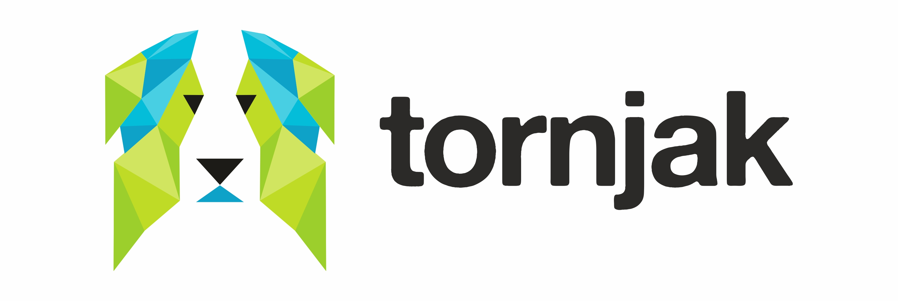

# Tornjak



**WARNING:** This project is in the
["Development"](https://github.com/spiffe/spiffe/blob/main/MATURITY.md#development) 
phase of the [SPIFFE Project Maturity
Phases](https://github.com/spiffe/spiffe/blob/main/MATURITY.md).


The project aims to provide a management plane and capabilities for SPIFFE identities managed by SPIRE.
The goals are to provide global visibility, auditability, and configuration and policy management for identities.
This can be thought about as a central management plane for identities across SPIRE servers, with the aim for use by an administrator or CISO to govern an organization's workload identities.

## Get Started

The following are guides on how to try out Tornjak:
- [Tornjak simple deployment with SPIRE k8s quickstart](docs/spire-quickstart.md)

Here are a few additional resources:
- [Tornjak basic functions demo](https://www.youtube.com/watch?v=dOdRu4psKJ8)

## Architecture and roadmap

The architecture consists of 2 main components, the agent and the manager.
- The manager provides a management control plane for SPIRE servers, and a central point of data collection. It interacts with the agents, SPIRE servers, and corresponding components to achieve this.
- The agent provides a way for the management plane to communicate with the SPIRE servers and provide introspection and configuration of identities.

For more details of the components and execution plan, please refer to these documents
- [Manager design and details](docs/tornjak-manager.md)
- [Agent design and details](docs/tornjak-agent.md)
- [Execution plan](docs/plan.md)

## Development: Building and pushing

The binary and container can be built with the following command, replacing the container tag with the desired container tag of choice. 


This makes the tornjak agent + spire server container:

```
CONTAINER_TAG=lumjjb/tornjak-spire-server:latest make container-agent
```

The container is run with the same arguments as the SPIRE server image, and usage is transparent. It runs a server hosted on port 10000 accessed via http.

### Testing and validating the Tornjak front-end
To start a local version of the Tornjak front-end server 
point at the running Tornjak APIs:

```console
cd tornjak-frontend
REACT_APP_API_SERVER_URI=http://<tornjak_API>/  npm start
```

Assuming `npm` is installed, this will start a server on `http://localhost:3000`
Please be patient, as it might take a few minutes to compile and start the server.
