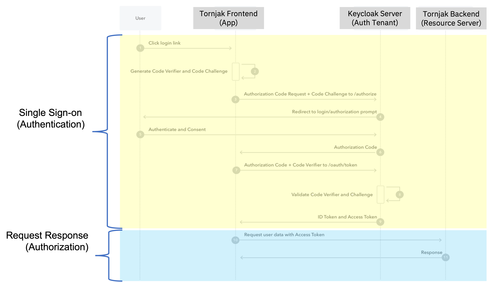

# User Management

This document compiles all the information on the integration of user management with Tornjak. 

Currently, user management is available only for a single instance of a Tornjak agent with a Frontend. 

## Overview

We follow the OAuth2.0 spec for authentication. The diagrams below show the implemented [Standard Authorization Code Flow](https://auth0.com/docs/get-started/authentication-and-authorization-flow/authorization-code-flow):


We will eventually be implementing the [Authorization Code Flow with PKCE](https://auth0.com/docs/get-started/authentication-and-authorization-flow/authorization-code-flow-with-proof-key-for-code-exchange-pkce) to secure the backend with a public frontend application. This is necessary as the public frontend cannot store client secrets securely: 


A more in-depth Medium article for the overall architecture can be found [here](https://medium.com/universal-workload-identity/identity-access-management-iam-integration-with-tornjak-749984966ab5). 

## Architecture

[TODO insert architecture diagram here]

The architecture integrates with a separate Auth server. This Auth server is used to secure the backend, which can be configured to expected access tokens signed by a given list of public keys.  Then, any callers to the Auth server must be able to obtain such an access token.  

## General Deployment

User management requires the following:

*  There must be an existing, pre-configured Auth Server to integrate with Tornjak (e.g. Keycloak)
*  The Tornjak Backend is deployed with a configuration pointing to said Auth Server. 
*  The Tornjak Frontend must be deployed configured to obtain access tokens from said Auth Server before sending calls to the Tornjak Backend. 

## Examples and Tutorials

We have experimented extensively with the open source Keycloak Auth Server. 
Specifically, it is very easy to set up a Tornjak secured by Keycloak today, by following these steps: 

1. **Configure Auth Server**
To configure the Auth Server, please see our [Medium blog](https://medium.com/universal-workload-identity/step-by-step-guide-to-setup-keycloak-configuration-for-tornjak-dbe5c3049034) for a walkthrough on configuring the Auth Server. For more in-depth documentation on this setup, please see [this document on Keycloak configuration](./keycloak-configuration.md).

1. **Enable User Management for Tornjak Backend**
Once the Auth Server is set up, we can deploy the Tornjak Backend to require access tokens from our Auth Server, 
as detailed in 
[this followup Medium blog](https://medium.com/universal-workload-identity/guide-to-integrating-tornjak-with-keycloak-for-access-control-to-spire-40a3d5ee5f5a), 
with more details on the general configuration 
[here](https://github.com/spiffe/tornjak/blob/main/docs/config-tornjak-agent.md). 

1. **Configure Tornjak Frontend**
Finally, the Frontend must be deployed and configured to obtain access tokens from this auth server. 
This can be done locally with the environment variable 
`REACT_APP_AUTH_SERVER_URI`:

```
cd tornjak-frontend
REACT_APP_API_SERVER_URI=http://localhost:10000/
REACT_APP_AUTH_SERVER_URI=http://localhost:8080/ npm start
```

Alternatively, we can do the same on the containerized version:

```
docker run -p 3000:3000 -d -e REACT_APP_API_SERVER_URI='http://localhost:10000' -e REACT_APP_AUTH_SERVER_URI='http://localhost:8080' ghcr.io/spiffe/tornjak-frontend:v1.2.2
`
```

This will start a Tornjak server on `http://localhost:3000`
Please be patient, as it might take a few minutes to compile and start the server.

For a cloud deployment change the URLs accordingly using the cloud provider ingress.

Given the Auth Server configuration above, we have `an admin` and `a viewer` user type. 
An Admin User has an admin level privileges allowing create, configure, and delete operations. 
The Viewer User has a restricted access for the Tornjak UI, allowing only read and list operations.  
